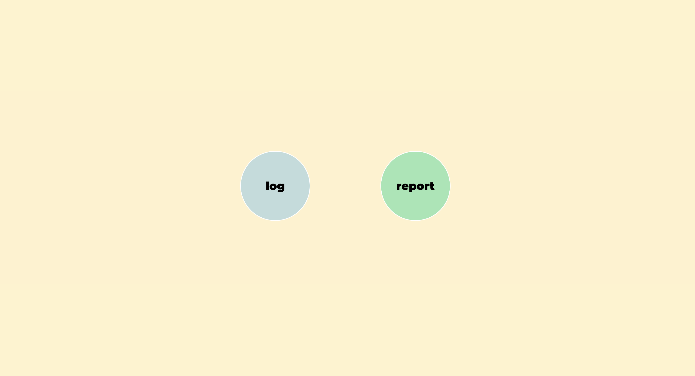
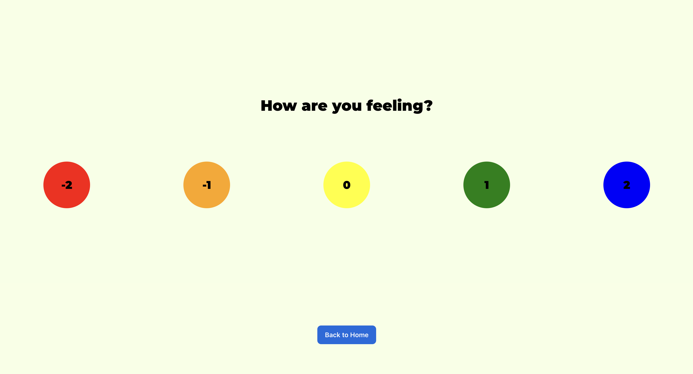
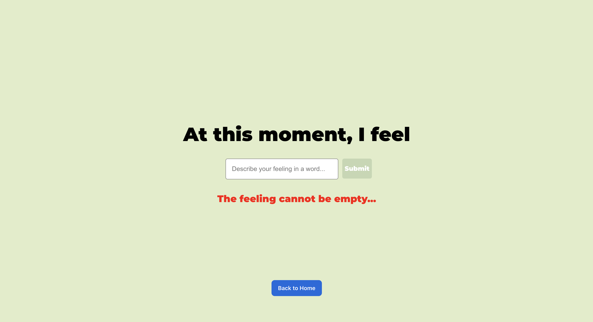
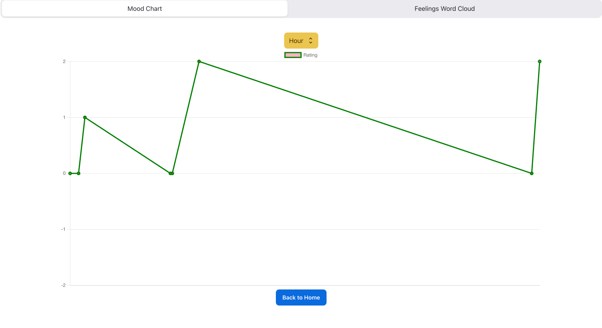
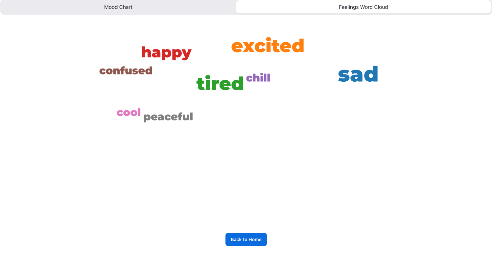
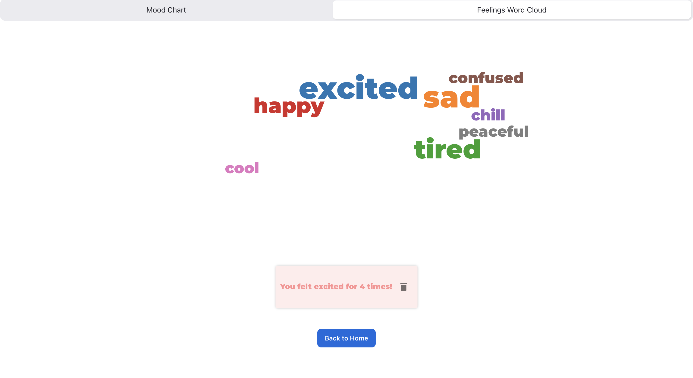

# MOOD TRACK APP-FRONTEND

#### An app to keep track of your mood

## Table of Contents

- [Summary](#summary)
- [Author](#author)
- [Goals](#goals)
  - [Project First Itearation Goals](#project-first-iteration-goals)
  - [Extension Goals for Future Iterations](#extension-goals-for-future-iterations)
- [Install Locally](#install-locally)

## Summary

This is an react app to help users keep track of their feelings. User can rate their moods and log in their feelings and be mindful of their mental state. The purpose of creating this app is to use in classroom for students' mood check in. It helps generate data and allows me to intentionaly check on students' feelings during the school day. 

## Author

#### Lingling Gan

Github: [github.com/MandyGan](https://github.com/MandyGan)

LinkedIn: [linkedin.com/in/lingling-gan/](https://www.linkedin.com/in/lingling-gan/)

## Goals

### Project Goal

- Use React to create a mood track app 
- Users can log their mood by selecting rating ranging from -2 to 2 
- Users can log their feeling by inputing a word 
- Users can view their mood trend based on minute, hour, day, week and month
- Users can view their the frequency of each feeling in a word cloud 

### Extension Goals 

- Build the back-end for the mood-track-app using node.js and express
- Use Postgres to store data
- Build CRUD for users 
- Build CRUD for moods 
- Build CRUD for feelings 
- Build Authentication for register and logins 

### ScreenShots 

 

